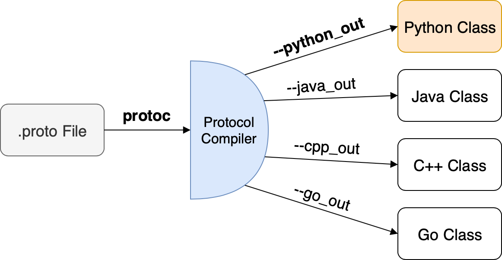

# Installation steps

## Step-1: Install Dependencies

[Install Google Protobuf](https://github.com/protocolbuffers/protobuf/blob/master/src/README.md)

```bash
sudo apt-get install autoconf automake libtool curl make g++ unzip -y
git clone https://github.com/google/protobuf.git
cd protobuf
git submodule update --init --recursive
./autogen.sh
./configure
make
make check
sudo make install
sudo ldconfig
```

## Step-2: Install Tensorflow Object Detection API

You can install the TensorFlow Object Detection API either with **Python Package Installer \(pip\)** or **Docker**. Broadly the steps are mentioned in the [official documentation page](https://github.com/tensorflow/models/blob/master/research/object_detection/g3doc/tf1.md) but I documented more comprehensively here.

#### Clone the TensorFlow Models repository and proceed to one of the installation options.

```bash
git clone https://github.com/tensorflow/models.git
```



#### 1. Install and configure Python `virtualenv` and `virtualenvwrapper`

```bash
sudo pip install virtualenv virtualenvwrapper
```


Now, add the following lines to your ~/.bashrc

```bash
# virtualenv and virtualenvwrapper
export WORKON_HOME=$HOME/.virtualenvs
export VIRTUALENVWRAPPER_PYTHON=/usr/bin/python3
source /usr/local/bin/virtualenvwrapper.sh
```

Create a python virtual environment

```bash
mkvirtualenv tf_1.15 -p python3
```

This will automatically start using the tf\_1.15 virtual environment

#### 2. Install TensorFlow 1.15

Install TensorFlow in virtual environment

```bash
pip install --no-cache-dir -U pip absl-py tensorflow-gpu==1.15
```

#### 2. Generate Python specific files using .protoc

Using a `.proto` file, you can export python specific code



Go to root of cloned `model` directory, and copy-paste the following

```bash
cd models/research
# Compile protos.
protoc object_detection/protos/*.proto --python_out=.

# Install TensorFlow Object Detection API.
cp object_detection/packages/tf1/setup.py .
python -m pip install --use-feature=2020-resolver .
```

```bash
# this is done in research directory every time models is used 
# if you do not need to do it time and again, then replace `pwd` with
# your absolute path to models directory and append it to .bashrc file
export PYTHONPATH=$PYTHONPATH:`pwd`:`pwd`/slim
```




[Install Docker Engine on Ubuntu](https://docs.docker.com/engine/install/ubuntu/)


Go to your model root directory and copy-paste below lines to start building docker image

```bash
# From the root of the git repository
docker build -f research/object_detection/dockerfiles/tf1/Dockerfile -t od .
```

Spin up a container

```bash
docker run -it --rm --gpus all --name od
```


It is assumed that [NVIDIA Container Toolkit](https://github.com/NVIDIA/nvidia-docker) is already installed




## Step-3: Test your installation

Run the code below from inside the model directory

```bash
python object_detection/builders/model_builder_test.py
```

In either case, running tests should give the following output

```bash
WARNING:tensorflow:
The TensorFlow contrib module will not be included in TensorFlow 2.0.
For more information, please see:
  * https://github.com/tensorflow/community/blob/master/rfcs/20180907-contrib-sunset.md
  * https://github.com/tensorflow/addons
  * https://github.com/tensorflow/io (for I/O related ops)
If you depend on functionality not listed there, please file an issue.

WARNING:tensorflow:From /home/acer/workspace/others/github/models/research/slim/nets/inception_resnet_v2.py:373: The name tf.GraphKeys is deprecated. Please use tf.compat.v1.GraphKeys instead.

WARNING:tensorflow:From /home/acer/workspace/others/github/models/research/slim/nets/mobilenet/mobilenet.py:389: The name tf.nn.avg_pool is deprecated. Please use tf.nn.avg_pool2d instead.

Running tests under Python 3.6.9: /home/acer/.virtualenvs/tf_1.15/bin/python
[ RUN      ] ModelBuilderTest.test_create_embedded_ssd_mobilenet_v1_model_from_config
/home/acer/.virtualenvs/tf_1.15/lib/python3.6/site-packages/tensorflow_core/python/framework/tensor_util.py:521: DeprecationWarning: tostring() is deprecated. Use tobytes() instead.
  tensor_proto.tensor_content = nparray.tostring()
[       OK ] ModelBuilderTest.test_create_embedded_ssd_mobilenet_v1_model_from_config
[ RUN      ] ModelBuilderTest.test_create_faster_rcnn_inception_resnet_v2_model_from_config
WARNING:tensorflow:From /home/acer/workspace/others/github/models/research/object_detection/anchor_generators/grid_anchor_generator.py:59: to_float (from tensorflow.python.ops.math_ops) is deprecated and will be removed in a future version.
Instructions for updating:
Use `tf.cast` instead.
W0515 06:25:17.288919 140692468442944 deprecation.py:323] From /home/acer/workspace/others/github/models/research/object_detection/anchor_generators/grid_anchor_generator.py:59: to_float (from tensorflow.python.ops.math_ops) is deprecated and will be removed in a future version.
Instructions for updating:
Use `tf.cast` instead.
[       OK ] ModelBuilderTest.test_create_faster_rcnn_inception_resnet_v2_model_from_config
[ RUN      ] ModelBuilderTest.test_create_faster_rcnn_inception_v2_model_from_config
[       OK ] ModelBuilderTest.test_create_faster_rcnn_inception_v2_model_from_config
[ RUN      ] ModelBuilderTest.test_create_faster_rcnn_model_from_config_with_example_miner
[       OK ] ModelBuilderTest.test_create_faster_rcnn_model_from_config_with_example_miner
[ RUN      ] ModelBuilderTest.test_create_faster_rcnn_nas_model_from_config
[       OK ] ModelBuilderTest.test_create_faster_rcnn_nas_model_from_config
[ RUN      ] ModelBuilderTest.test_create_faster_rcnn_pnas_model_from_config
[       OK ] ModelBuilderTest.test_create_faster_rcnn_pnas_model_from_config
[ RUN      ] ModelBuilderTest.test_create_faster_rcnn_resnet101_with_mask_prediction_enabled0 (use_matmul_crop_and_resize=False)
[       OK ] ModelBuilderTest.test_create_faster_rcnn_resnet101_with_mask_prediction_enabled0 (use_matmul_crop_and_resize=False)
[ RUN      ] ModelBuilderTest.test_create_faster_rcnn_resnet101_with_mask_prediction_enabled1 (use_matmul_crop_and_resize=True)
[       OK ] ModelBuilderTest.test_create_faster_rcnn_resnet101_with_mask_prediction_enabled1 (use_matmul_crop_and_resize=True)
[ RUN      ] ModelBuilderTest.test_create_faster_rcnn_resnet_v1_models_from_config
[       OK ] ModelBuilderTest.test_create_faster_rcnn_resnet_v1_models_from_config
[ RUN      ] ModelBuilderTest.test_create_rfcn_resnet_v1_model_from_config
[       OK ] ModelBuilderTest.test_create_rfcn_resnet_v1_model_from_config
[ RUN      ] ModelBuilderTest.test_create_ssd_inception_v2_model_from_config
[       OK ] ModelBuilderTest.test_create_ssd_inception_v2_model_from_config
[ RUN      ] ModelBuilderTest.test_create_ssd_inception_v3_model_from_config
[       OK ] ModelBuilderTest.test_create_ssd_inception_v3_model_from_config
[ RUN      ] ModelBuilderTest.test_create_ssd_mobilenet_v1_fpn_model_from_config
[       OK ] ModelBuilderTest.test_create_ssd_mobilenet_v1_fpn_model_from_config
[ RUN      ] ModelBuilderTest.test_create_ssd_mobilenet_v1_model_from_config
[       OK ] ModelBuilderTest.test_create_ssd_mobilenet_v1_model_from_config
[ RUN      ] ModelBuilderTest.test_create_ssd_mobilenet_v1_ppn_model_from_config
[       OK ] ModelBuilderTest.test_create_ssd_mobilenet_v1_ppn_model_from_config
[ RUN      ] ModelBuilderTest.test_create_ssd_mobilenet_v2_fpn_model_from_config
[       OK ] ModelBuilderTest.test_create_ssd_mobilenet_v2_fpn_model_from_config
[ RUN      ] ModelBuilderTest.test_create_ssd_mobilenet_v2_fpnlite_model_from_config
[       OK ] ModelBuilderTest.test_create_ssd_mobilenet_v2_fpnlite_model_from_config
[ RUN      ] ModelBuilderTest.test_create_ssd_mobilenet_v2_keras_model_from_config
[       OK ] ModelBuilderTest.test_create_ssd_mobilenet_v2_keras_model_from_config
[ RUN      ] ModelBuilderTest.test_create_ssd_mobilenet_v2_model_from_config
[       OK ] ModelBuilderTest.test_create_ssd_mobilenet_v2_model_from_config
[ RUN      ] ModelBuilderTest.test_create_ssd_resnet_v1_fpn_model_from_config
[       OK ] ModelBuilderTest.test_create_ssd_resnet_v1_fpn_model_from_config
[ RUN      ] ModelBuilderTest.test_create_ssd_resnet_v1_ppn_model_from_config
[       OK ] ModelBuilderTest.test_create_ssd_resnet_v1_ppn_model_from_config
[ RUN      ] ModelBuilderTest.test_session
[  SKIPPED ] ModelBuilderTest.test_session
----------------------------------------------------------------------
Ran 22 tests in 0.076s

OK (skipped=1)
```


